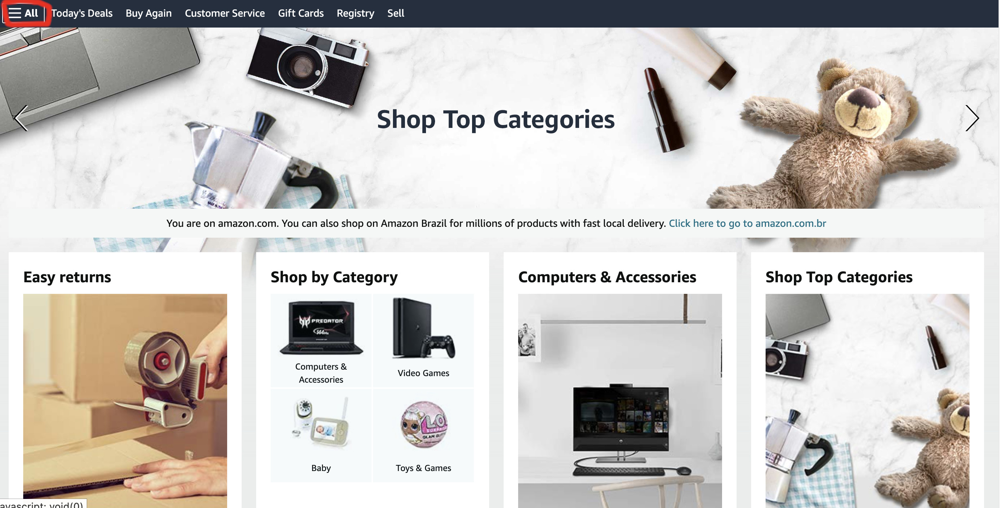
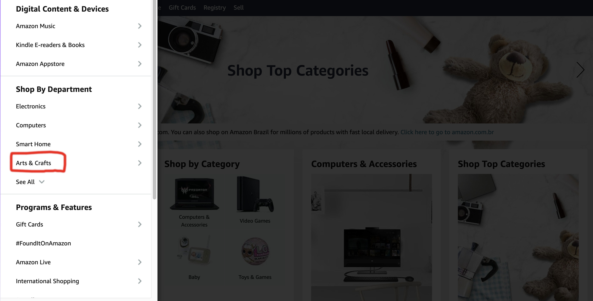
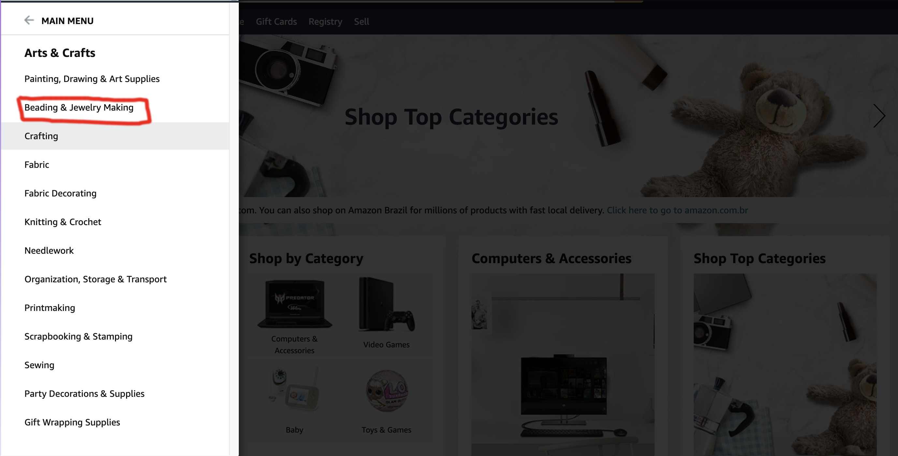
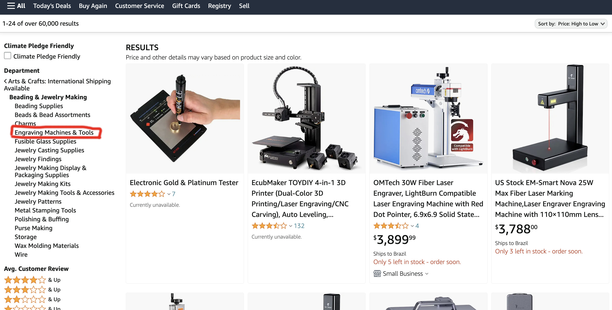
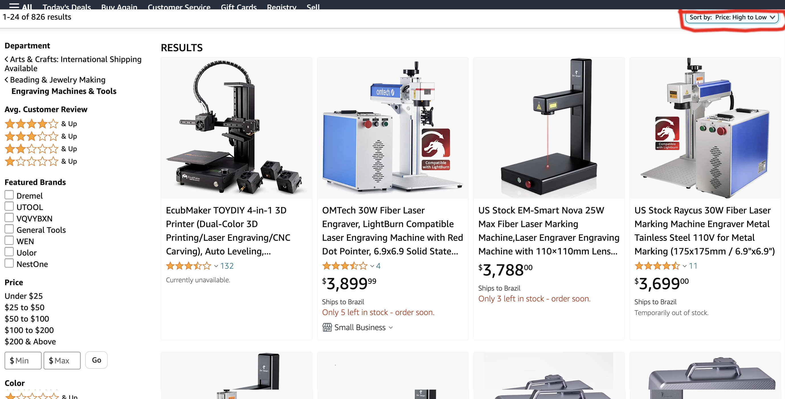

# sdet-automation-test
## What is Expected?
This is a code challenge to test your skills related to the development of automated tests. We use pytest with python, 
and allure for the reports, but feel free to use what you are comfortable with. 

This set of tests consists on two parts, one for a frontend test, and other for an API.

## First Scenario - Front End test
For this test you should follow the steps:
1. Go to https://www.amazon.com and expand the 'All' hamburger menu

2. Under 'Shop By Department' open 'Arts & Craft'

3. Open 'Beading & Jewelry Making'

4. Open 'Engraving Machines & Tools'

5. Sort by Price: High to Low

6. For the products that are currently available, open the third one
7. Check the review score. If it's less than 4, fail the test, otherwise pass it
8. Check the price for the opened item. If it's more than $4000, fail the test, otherwise pass it
9. Generate a report with the test result

## Second Scenario - API
NASA has an open API: https://api.nasa.gov/index.html#getting-started. Test the following scenarios
1. Query the Astronomy Picture of the Day with 5 images. See if the return has 5 entries in it.
2. Query the Astronomy Picture of the Day from 2022-05-05 to 2022-05-20. See if the return has 16 entries in it.
3. Create some integration scenarios to test edge, valid, and invalid scenarios for the Astronomy Picture of the Day API

Note: For all above tests, save all the results that doesn't have copyright to a json file under an output folder

## Repository
You will need to fork the repository and build the solution in Github publicly. Once you are finished, share your
repository with us. We expect this to be finished in one week, but if anything happens and this deadline cannot be met, 
reach out, so we know what is happening instead of think that you are not interested in this position anymore. 

## Deliverables:
* Code in a public Github repo
* README file with the notes, documentation, and instructions related to the code developed
