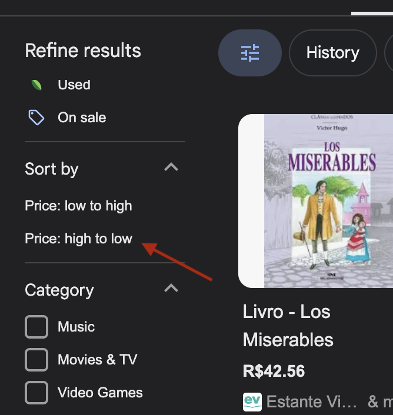
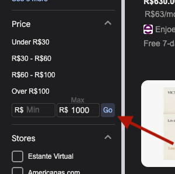

# sdet-automation-test
#### Version: 2.0

### What is Expected?
This is a code challenge to test your skills related to the development of automated tests. We use Pytest with Python, 
and Allure for the reports, but feel free to use any framework you are familiar with, as long as you develop it using 
Python.

The test consists in some steps to interact with a web page and assert some conditions, generating a report with the
test result after the execution.

## Test Scenario

For this test you should follow the steps:
1. Go to [google.com](https://www.google.com).
2. Search for "**book {BOOK_NAME}**" (e.g: The miserable, Blindness...).
3. Select Shopping.
4. Choose prices **High to Low**.

5. Define pricing up to **{AMOUNT}**. (e.g: 1000 or another real value, as currency might differ from running location).

6. From the second listed product **with rating**, confirm it has rating bigger or equal to **{RATING}**. (e.g: 4.5, 3.9)

### Implementation Requirements
1. Use data [parametrization](https://docs.pytest.org/en/stable/example/parametrize.html), instead hard coded data.
2. If possible, use [Fixtures](https://docs.pytest.org/en/stable/how-to/fixtures.html) (or something like) to go to the
page and perform the search (i.e. first three steps).

## Repository
You will need to fork the repository and build the solution in Github publicly. Once you are finished, share your
repository with us. 

We expect this to be finished in one week  (in fact, some dedicated hours might be enough), but if anything happens
and this deadline cannot be met, reach out, so we know what is happening instead of think that you are not interested
in this position anymore. 

## Deliverables
* Code in a public Github repository.
* README.md file with the notes, documentation, and instructions related to the code developed.
* The test execution should do the above steps and generate a report with the tests results. In case of a test failure,
it should also attach a screenshot of the current page when the test failed.
* Have the test parametrized so we can choose if we want to run it in headless mode or not.
